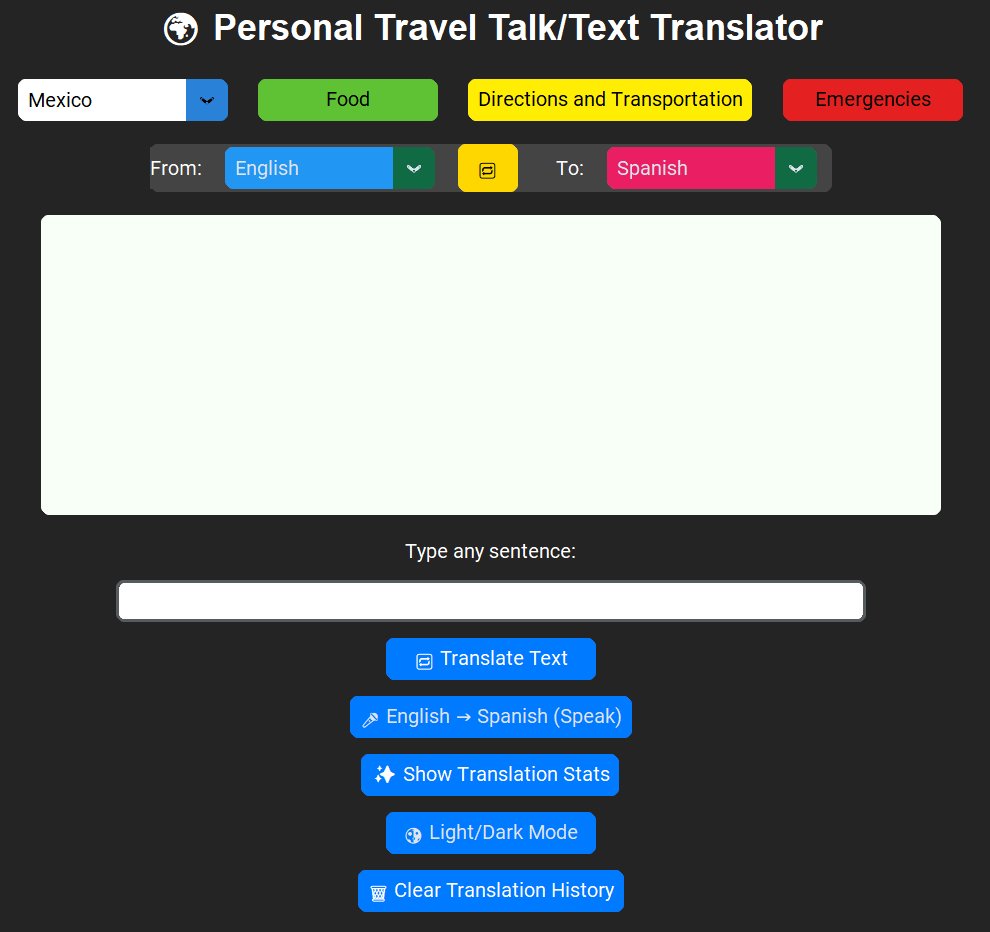

# 🌍 Travel Talk Translator

Travel Talk Translator is a desktop application built using Python and customtkinter to assist travelers in translating text and speech between multiple languages. The app includes preloaded travel phrases by category, real-time speech recognition, text-to-speech, and translation history tracking.

## 🔄 Running Log of Features

| Feature Description |
|---------------------|
| Implemented text translation functionality using deep_translator |
| Added speech recognition for voice input translation |
| Integrated pyttsx3 for offline text-to-speech output |
| Created GUI using customtkinter with modern styling |
| Added language swapping functionality |
| Enabled light/dark mode toggle |
| Implemented "Clear Translation History" button |
| Added more languages to JSON configuration files |
| Fixed issue where new input overwrote translation output without reset |
| Linked translation stats using Counter to track phrase frequency |
| Improved layout and spacing of UI elements for better usability |

